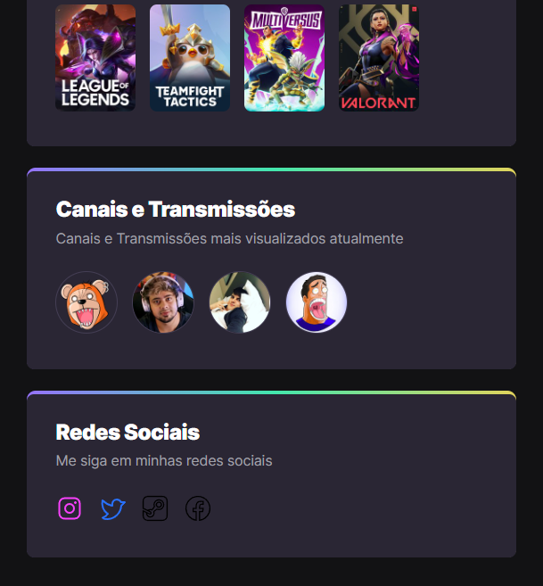

# NLW eSports

>Rota Explorer

Projeto construido no evento Next Level Week da Rocketseat.

>Iniciado no dia 18/09/2022.

>Terminado no dia 22/09/2022.

## Tecnologias Usadas

- HTML

- CSS

- GIT e GITHUB

## O que Aprendi?

- Reset dos padrões pré-determinados pelo navegador no css;

- Animações fluídas através do CSS;

- Link de imagem;

- Efeitos de Transição;

## Via de Contato

mariomito4001@gmail.com

